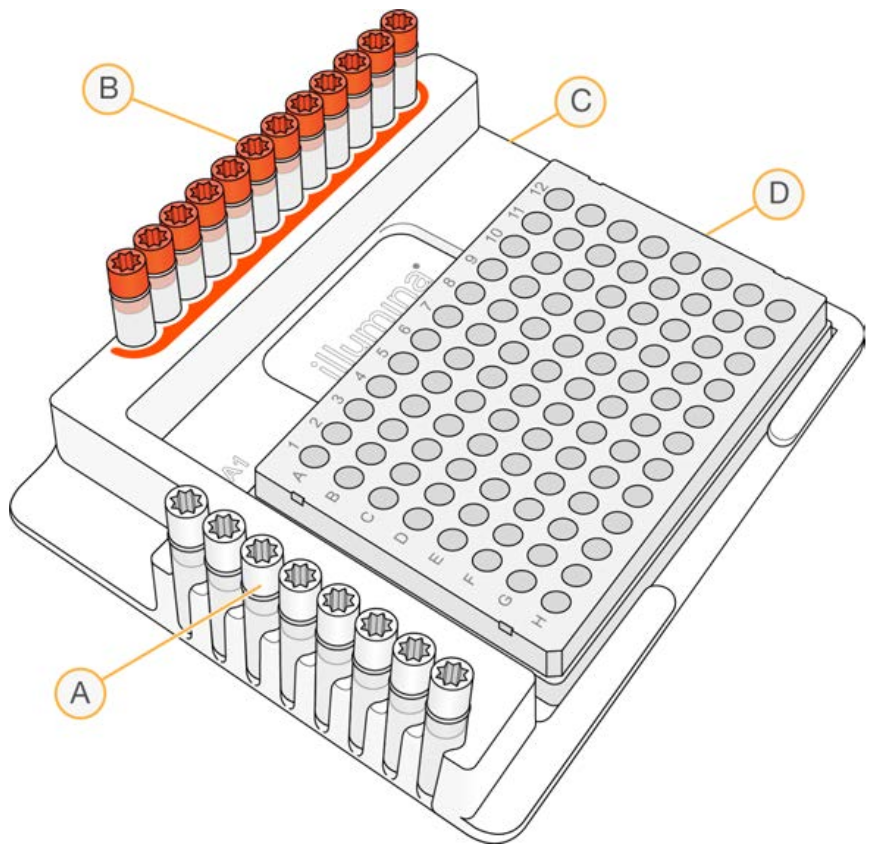

```{r setup, include=FALSE}
knitr::opts_chunk$set(echo = TRUE)
```

# Annealing of adapters
Adapter P1 will bind *HindIII* ends, and adapter P2 will bind *SphI* ends. Both adapters need to be annealed separately. Oligos are asumed to be suspended to 100 $\mu$M concentrations. The annealing buffer stock at 10$\times$ concentration should be 100 mM Tris HCl (pH 8), 500 mM NaCl, 10 mM EDTA [@Peterson2012].

```{r AnnealingBufferStock, echo=FALSE}
library(knitr)
AnnealingBufferStock <- data.frame(
  Reagent = c('Tris-HCl 1M pH 8.0', 'EDTA 0.5M', 'NaCl 1M', 'Water'),
  Amount = c(20, 4, 100, 76),
  Final = c(100, 10, 500, NA)
)
kable(AnnealingBufferStock, caption='10$\\times$ Annealing Buffer Stock, 200 $\\mu$l',
      col.names=c('Reagent', 'Amount to add ($\\mu$l)', 'Final concentration (mM)'))
```

Both adapters can be at a final concentration of 2.5 $\mu$M. We will use 1 $\mu$l per sample. We can prepare 500 $\mu$l of annealed stock of each adapter, to have them in a comfortable excess.

```{r Annealed adapters, echo=FALSE, results='asis'}
AnnealedAdapter <- data.frame(
  Reagent = c('Top oligo 100 $\\mu$M', 'Bottom oligo 100 $\\mu$M', '10$\\times$ Annealing buffer stock', 'Water', 'Total'),
  Amount = c(12.5, 12.5, 50, 425, 500)
)
kable(AnnealedAdapter, caption='\\textbf{Annealing reaction}. 500 $\\mu$l of 2.5 $\\mu$M annealed adapter. Two separate reactions must be prepared, for \\emph{HindIII} P1 and for \\emph{SphI} P2 adapters.',
      col.names=c('Reagent', 'Amount to add ($\\mu$l)'))
```

- **Adapter P1**: Mix 12.5 $\mu$l *HindIII*-P1.1 100 $\mu$M and 12.5 $\mu$l of *HindIII*-P1.2 100 $\mu$M oligos, 50 $\mu$l of 10$\times$ annealing buffer stock (see above), and 425 $\mu$l of water.
- **Adapter P2**: Mix 12.5 $\mu$l *SphI*-P2.1 100 $\mu$M and 12.5 $\mu$l of *SphI*-P2.2 100 $\mu$M oligos, 50 $\mu$l of 10$\times$ annealing buffer stock (see above), and 425 $\mu$l of water.

Anneal oligos in a thermal cycler; 95$^{\circ}$C 5 min, followed by a 0.1$^{\circ}$C/s ramp down to 20$^{\circ}$C. Keep small aliquots of annealed adapters in the freezer.

# Double digestion
@Salas-Lizana2018 set up digestion reactions in small volumes (9 $\mu$l), where DNA constitutes 67\% of the volume (in there in TE, which contain 1 mM Na$^+$ and 10 mM Cl$^-$, I think). On top of that, they add 0.45 $\mu$l of 1 M NaCl, reaching a salt concentration above 150 mM. That is higher than the salt concentration of a NEBuffer 3.1 (100 mM NaCl), where *SphI*-HF and *HindIII*-HF have 10% activity. That is, our enzymes are much more sensitive to salt than those used by @Salas-Lizana2018. Thus, we need to increase the volume of the digestion reaction to prevent salt-inhibition of the enzymes. The recommendation is to keep DNA volume below 25% of the total volume. The least concentrated samples require 10 $\mu$l of DNA to reach the 300 ng that we want to use. Thus, total reaction volume should be 40 $\mu$l.

I assume enzymes are at 20000 U/ml. In general, 10 U of enzyme (1 $\mu$l) are supposed to be enough for 1 $\mu$g of DNA. We are using up to 300 ng of DNA in the reaction. If the number of units required are proportional to the amount of DNA, 0.3 $\mu$l of each enzyme (3 U) should be enough for 300 ng. If we use use 0.8 $\mu$l of each enzyme (in 50% glicerol) in a 40 $\mu$l reaction, the final glicerol concentration would be `r 0.5 * 2 * 0.8 / 40`%, which is lower than the maximum recommended of 5%.

```{r digestion, echo=FALSE}
DNA.volume <- 10 # µl
TotalReactionVolume <- DNA.volume * 4 # µl
Buffer10XVolume <- 0.1 * TotalReactionVolume
SphI.volume <- 0.8
HindIII.volume <- 0.8
Water.volume <- TotalReactionVolume - Buffer10XVolume - DNA.volume - SphI.volume - HindIII.volume
DigestionMix <- data.frame(
  Component = c('10$\\times$ rCutSmart Buffer', 'SphI-HF', 'HindIII-HF', 'Nuclease-free water', 'Total mix volume per sample'),
  Volum = c(Buffer10XVolume, SphI.volume, HindIII.volume, Water.volume, TotalReactionVolume - DNA.volume)
)
kable(DigestionMix, caption = sprintf('Double digestion master mix. Multiply volumes by 1.2 times the number of samples. The total volume of master mix per sample is %.1f $\\mu$l', TotalReactionVolume - DNA.volume),
      col.names = c('Component', 'Volum per reaction ($\\mu$l)'))
```

1. Prepare the double digestion master mix (see table above) for 1.2$\times$ the number of samples.
2. Mix `r TotalReactionVolume - DNA.volume` $\mu$l of double digestion master mix with `r DNA.volume`  $\mu$l of sample DNA in each PCR tube or well.
3. Centrifuge briefly (spin down?) and incubate at 37$^\circ{}$C for 4 hours in a thermal cycler with a heated lid. Note: both enzymes are "Time-Saver qualified" (according to NEB), so they are supposed to do the job in 15 minutes.
4. Do **not** heat inactivate the enzymes, because adapters are designed not to reconstitute the restriction target sites upon ligation.

# Ligation of adapters
We will add the ligation reaction components in two times: first the adapters and then the T4 DNA ligase. Note that @Salas-Lizana2018 put everything together in a single Ligation Master Mix. However, I want to mix the annealed adapters with the digested genomic DNA before adding the T4 DNA ligase. Otherwise, the ligase would start working on the adapters.

Let ATP thaw at room temperature and keep in ice to minimize degradation. Resuspend the CutSmart buffer at room temperature as well. Keep adapters and the whole mixture cool to keep adapters annealed. Prepare the two mixtures separately. Volumes are set to ease pippetting.

\newpage

```{r LigationMasterMix, echo=FALSE}
AdapterVolume  <- 5
T4volume  <- 0.695
LigaseVolume <- 5
ATPvolume <- (TotalReactionVolume + AdapterVolume + LigaseVolume) / 10
# ATP is at 10mM, and I think it must be at 1 mM in the ligation reaction. 
# But together with the ATP we must add CutSmart buffer, so I make room for it:
while (ATPvolume > 0.9 * LigaseVolume - T4volume) {
  LigaseVolume <- LigaseVolume + 0.01
  ATPvolume <- (TotalReactionVolume + AdapterVolume + LigaseVolume) / 10
}
water1 <- AdapterVolume - 2 - 0.1 * AdapterVolume # The 2 µl are for the adapters
water2 <- LigaseVolume - T4volume - 0.1 * LigaseVolume - ATPvolume
ReactionVolume <- TotalReactionVolume + AdapterVolume + LigaseVolume
AdapterMix <- data.frame(
  Reagent = c('HindIII-P1 adapter 2.5 $\\mu$M', 'SphI-P2 adapter 2.5 $\\mu$M', 'CutSmart buffer 10$\\times$', 'Water'),
  Amount = c(1, 1, 0.1 * AdapterVolume, water1)
)
Caption <- sprintf('\\textbf{Adapter Mix}. Multiply volumes by 1.2 times the number of samples. The total volume of adapter mix per sample is %.2f $\\mu$l.', AdapterVolume)
kable(AdapterMix, caption=Caption,
      col.names = c('Component', 'Volume per reaction ($\\mu$l)'))

LigaseMix <- data.frame(
  Reagent = c('ATP 10 mM', 'CutSmart buffer 10$\\times$', 'T4 DNA ligase 400000 U/ml', 'Water'),
  Amount = c(ATPvolume, 0.1 * LigaseVolume, T4volume, water2)
)
Caption <- sprintf('\\textbf{T4 DNA Ligase Mix}. Multiply volumes by 1.2 times the number of samples. The total volume of T4 DNA ligase mix per sample is %.2f $\\mu$l.', LigaseVolume)
kable(LigaseMix, caption=Caption,
      col.names = c('Component', 'Volume per reaction ($\\mu$l)'))
```

1. Add `r AdapterVolume` $\mu$l of the adapter mix to every digested sample. Mix well and incubate at room temperature for 5-10 minutes. Return to ice.
2. Add `r LigaseVolume` $\mu$l of the T4 DNA ligase mixture to every sample. Mix well and incubate at 16$^{\circ}$C overnight (or for at least 2 hours). The total reaction volume will be `r ReactionVolume` $\mu$l.

# Clean up with magnetic beads

We use the NucleoMag\textsuperscript{\textregistered} NGS clean-up and size selection product, by Machery Nagel. We realized that the clean up protocol works best with U-bottom wells, which fit Machery-Nagel's magnetic support. As for @Salas-Lizana2018's warning that "working with no more than 48 samples at once gives best results", we understand one important reason for this is to have all samples dry the same amount of time, after washing with alcohol. 

For the most part, we followed provider's instructions, but applied a single wash step with alcohol, instead of two. In summary:

1. Let the beads solution stand outside the fridge for about 30 minutes to reach room temperature.
2. Prepare enough fresh 80% ethanol for the number of samples that will be processed at once. Count `r ceiling(1.9 * ReactionVolume)` $\mu$l per sample and 1.2 $\times$ the number of samples.
3. Mix well until suspension is homogeneous.
4. Add 0.9$\times$ volumes of NucleoMag\textsuperscript{\textregistered} beads (to keep fragments above 200 bp) to ligation products. That is `r ReactionVolume * 0.9` $\mu$l, in our case but let's round it to `r round(ReactionVolume * 0.9)` $\mu$l. Mix by pipetting up and down 10 times.
6. **Incubate** the separation plate at **room temperature** for **5 min**.
7. Place the 96-well plate on the NucleoMag\textsuperscript{\textregistered} SEP magnetic separator. Wait at least **5 min** until all the beads have been attracted to the magnets or until the liquid appears clear. The DNA must be adsorbed to the beads.
8. Remove and discard supernatant by pipetting. Be very careful not to disturb the attracted beads while aspirating the supernatant. Remove supernatant from the opposite side of the well.
9. Leaving the 96-well plate on the magnetic separator, add one volume of **80% ethanol** (that is, `r ceiling(1.9 * ReactionVolume)` $\mu$l) without disturbing the pellet.
10. Incubate the separation plate at room temperature for at least **30 s**.
11. Remove and discard the supernatant carefully and completely, by pipetting. (This is the single wash step. We skip the second to maximize yield).
12. Leave the 96-well plate on the magnetic separator and incubate at room temperature for about 5 min in order to allow the remaining traces of alcohol to evaporate. Do not overdry the beads. Only until droplets of alcohol are no longer visible. Otherwise, the pellet would not be resuspended and long fragments of DNA would elute less efficiently. Here, working with too many samples makes it difficult for all of them to be dried the same amount of time.
13. Remove the 96-well plate from the NucleoMag\textsuperscript{\textregistered} SEP magnetic separator.
14. Add 25 $\mu$l of elution buffer (Tris-HCl 5 mM, pH 8.5) and **resuspend** the pellet by pipetting up and down 10 times, or by shaking.
15. **Incubate** the separation plate at room temperature for **2-5 min**.
16. **Separate** the magnetic beads against the side of the wells by placing the 96-well plate on the NucleoMag\textsuperscript{\textregistered} SEP magnetic separator. Wait at least 5 min until all the beads have been attracted to the magnets or until the liquid appears clear.
17. **Transfer** the supernatant containing the purified DNA fragment library to a new 96-well plate.

# PCR amplification with incorporation of Nextera indices

This step incorporates Nextera Index Kit v2 primers with unique indexes to the adapters and enrich the library before sequencing. A unique combination of P5 and P7 indexed primers are used for each individual. Therefore it is advisable to prepare a plate (or tubes) with each pair of primers with anticipation for this step. Use fresh primer aliquots for better results. Include a negative control to measure background primer dimer concentration.

```{r echo=FALSE, fig.cap='Figure taken without permission from the Reference Guide of Nextera XT DNA Library Prep Kit (Illumina, document number 15031942 v03, February 2018). A, rows A-H for index 2 (i5) adapters (white caps); B, Columns 1-12 for index 1 (i7) adapters (orange caps); C, TruSeq Index Plate Fixture; D, Hard-shell PCR plate.', fig.align='center', out.width='45%'}

```

@Salas-Lizana2018 sets up a 25 $\mu$l reaction per sample, and then divide it in two 12.5 $\mu$l reactions. We also set up two PCR reactions per sample, understanding it helps even up the reaction-specific amplification biases. But we prefer to run PCR in 25 $\mu$l volumes. Because we use AmpliTaq Gold\textsuperscript{\textregistered} 360 Master Mix (Applied Biosystems), which is at 2$\times$ the required concentration, we can use up to 10 $\mu$l of DNA per reaction. Having eluted in 25 $\mu$l before, we don't see a reason not to use most of the DNA in the amplification, reserving only 5 $\mu$l for quantification purposes.

It may be more comfortable to prepare a 50 $\mu$l reaction and then split it in two. Do not forget to include a negative control with water instead of DNA. The *master mix* should include only the AmplitTaq Gold\textsuperscript{\textregistered} master mix and some water, because the DNA is already in the plates and the primers are sample-specific:

```{r PCRmix, echo=FALSE}
DNA.volume <- 20
AmpliTaq   <- 25
index1.i7  <- 2
index2.i5  <- 2
water      <- 1
TotalPCR   <- DNA.volume + AmpliTaq + index1.i7 + index2.i5 + water

PCR <- data.frame(
  Reagent = c('AmpliTaq Gold MM', 'Nuclease-free water', 'Total per sample'),
  Amount  = c(AmpliTaq,            water,                 AmpliTaq + water)
)
kable(PCR, caption = '\\textbf{PCR master mix}. Multiply by the number of samples $\\times 1.2$.', col.names = c('Component', 'Volume per sample ($\\mu$l)'))
```

1. Prepare **twice** the number of plates necessary to accommodate all samples. That is, 8 plates in our case.
1. Deposit `r DNA.volume` $\mu$l of template DNA in every well of a plate, with care to prevent cross-contamination.
2. Arrange primers around the 96-well plate containing the template DNA, as shown in the figure.
3. Using a multichannel pipette, add `r index1.i7` $\mu$l of each Index 1 (i7) adapter down each column. Replace the cap on each i7 adapter tube with a new orange cap.
4. Using a multichannel pipette, add `r index2.i5` $\mu$l of each Index 2 (i5) adapter across each row. Replace the cap on each i5 adapter tube with a new white cap.
5. Add `r AmpliTaq + water` $\mu$l of the PCR master mix to each well containing index adapters. Pipette to mix.
6. At this point, the Nextera XT DNA Library Prep Reference Guide suggests to centrifuge at 280 $\times g$ at 20$^\circ$C for 1 minute. I guess it just needs to be spinned down. The volume per sample must be `r TotalPCR` $\mu$l.
7. Using a multichannel pipette, transfer half the PCR volume (`r TotalPCR / 2` $\mu$l) of every sample to a new, clean 96-well plate. This way we split the DNA in two PCRs, in order to even up the reaction-specific amplification biases. Be careful to prevent cross-contamination.
8. Run the following PCR program for both plates of every subset of samples:

  - Choose the preheat lid option.
  - Initial denaturalization: 98$^\circ$C for 30 seconds.
  - 16 cycles of:
  
    - Denaturalization at 98$^\circ$C for 20 seconds.
    - Hybridization at 60$^\circ$C for 30 seconds.
    - Elongation at 72$^\circ$C for 60 seconds.
    
  - Final elongation at 72$^\circ$C for 60 seconds.
  
# Clean up
There are several reasons to include a second clean up step here. First, for DNA quantification, both in Qubit and Bioanalyser it is better to remove the primers, nucleotides, polymerase, MgCl\textsubscript{2}. The polymerases and any other proteins present in the AmpliTaq buffer could reduce the yield in the size selection step. On top of that, both the size selection and the sequencing itself can be seriously affected by salinity. And we are planning to concentrate DNA by evaporation, which would concentrate the salts as well. Some protocols even include a clean up step between digestion and ligation. So, to clean is good and we should do it once more.

1. Combine the two PCR products of the same sample. The volume will be 50 $\mu$l per sample.
1. Let the beads solution stand outside the fridge for about 30 minutes to reach room temperature.
2. Prepare enough fresh 80% ethanol for the number of samples that will be processed at once. Count `r ceiling(1.9 * 50)` $\mu$l per sample and 1.2 $\times$ the number of samples.
3. Mix well until suspension is homogeneous.
4. Add 0.9$\times$ volumes of NucleoMag\textsuperscript{\textregistered} beads (to keep fragments above 200 bp) to ligation products. That is `r 50 * 0.9` $\mu$l in our case. Mix by pipetting up and down 10 times.
6. **Incubate** the separation plate at **room temperature** for **5 min**.
7. Place the 96-well plate on the NucleoMag\textsuperscript{\textregistered} SEP magnetic separator. Wait at least **5 min** until all the beads have been attracted to the magnets or until the liquid appears clear. The DNA must be adsorbed to the beads.
8. Remove and discard supernatant by pipetting. Be very careful not to disturb the attracted beads while aspirating the supernatant. Remove supernatant from the opposite side of the well.
9. Leaving the 96-well plate on the magnetic separator, add one volume of **80% ethanol** (that is, `r round(1.9 * 50, 1)` $\mu$l) without disturbing the pellet.
10. Incubate the separation plate at room temperature for at least **30 s**.
11. Remove and discard the supernatant carefully and completely, by pipetting. (This is the single wash step. We skip the second to maximize yield).
12. Leave the 96-well plate on the magnetic separator and incubate at room temperature for about 5 min in order to allow the remaining traces of alcohol to evaporate. Do not overdry the beads. Only until droplets of alcohol are no longer visible. Otherwise, the pellet would not be resuspended and long fragments of DNA would elute less efficiently. Here, working with too many samples makes it difficult for all of them to be dried the same amount of time.
13. Remove the 96-well plate from the NucleoMag\textsuperscript{\textregistered} SEP magnetic separator.
14. Add 35 $\mu$l of **nuclease-free water** and **resuspend** the pellet by pipetting up and down 10 times, or by shaking. We use water to be able to evaporate latter without increasing too much the ionic strength.
15. **Incubate** the separation plate at room temperature for **2-5 min**.
16. **Separate** the magnetic beads against the side of the wells by placing the 96-well plate on the NucleoMag\textsuperscript{\textregistered} SEP magnetic separator. Wait at least 5 min until all the beads have been attracted to the magnets or until the liquid appears clear.
17. **Transfer** the supernatant containing the purified DNA fragment library to a new 96-well plate.

# Pooling in equimolar proportion

1. Use 2 $\mu$l per sample for quantification in Qubit.
2. Select at least 11 (or 22) samples to be quantified also with BioAnalyser.
3. Aim at combining 50 ng of DNA per sample. (If concentrations are between 2 and 6 ng/$\mu$l, that would be between 8 and 25 $\mu$l per sample). We can distribute the 250 samples in 5 pools of between 500 and 1500 $\mu$l, where concentration would be the harmonic mean of the concentrations of the combined samples, I think. 
4. Concentrate the pools by evaporation. To concentrate up to 100 ng/$\mu$l, we would have to reduce the volume of every eppendorf from 500 or 1000 to only 25 $\mu$l, which may be too much. Reducing the volumes to 50 $\mu$l would produce concentrations around 50 ng/$\mu$l, which are still low, but acceptable.

# Size selection

I estimate the fraction of the genome represented by fragments between 300 and 900 bp to be around 5%. So, even if we got the highest exptected yield from the Pippin Prep (80%), and if we had concentrated the pool at 100 ng/$\mu$l, we would recover only `r 100 * 30 * 5 * 0.05 * 0.8` ng of size-selected DNA. This is how the final concentration is supposed to correspond to the initial one:

```{r pippinprep, echo=FALSE}
library(ggplot2)
PippinPrep <- data.frame(
    PoolConcentration = rep(1:167, 2),
    YieldNumeric = rep(c(0.50, 0.80), each = 167),
    Yield = rep(c('50%', '80%'), each=167)
)
MassInRange <- 0.05    # Fraction of the genome in fragments of desired length, including non-target.
ElutionVolume <- 40
LoadedVolume <- 30
NumberOfLanes <- 5
PippinPrep$FinalConcentration <- PippinPrep$PoolConcentration * LoadedVolume * NumberOfLanes * MassInRange * PippinPrep$YieldNumeric / (ElutionVolume * NumberOfLanes)
ggplot(PippinPrep, mapping = aes(x = PoolConcentration, y = FinalConcentration, color = Yield)) + geom_line() +
  xlab('Original pool concentration (ng/µl)') + ylab('Size-selected concentration (ng/µl)')
```

The size-selection step in itself is just a matter of providing at least 30 $\mu$l of the pool per lane. After that:

1. Combine the 40 $\mu$l eluted from each lane in a unique pool.
2. Quantify and optionally run the Bioanalyser to check the size selection.
3. Concentrate as needed to satisfy sequencer's requirements.


# References