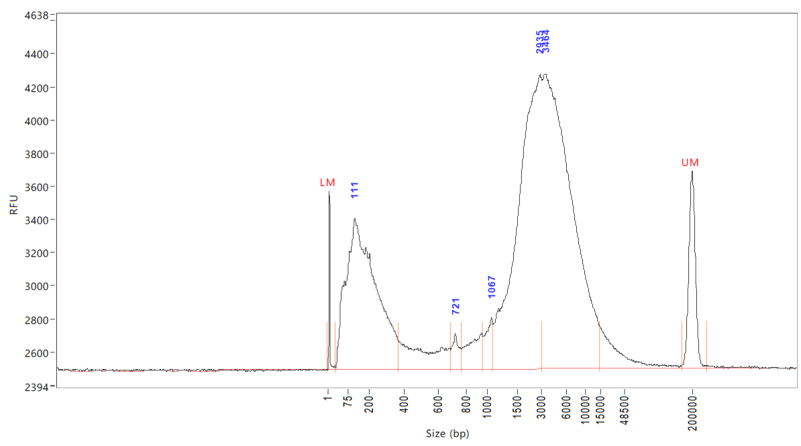

```{r setup, include=FALSE}
knitr::opts_chunk$set(echo = TRUE)
library(SimRAD)
library(ggplot2)
library(dplyr)
library(RColorBrewer)
```

Results from double digestions do not resemble the expected distribution of fragment sizes.
I suspect one of the enzymes may not be working properly, and I want to see the expected
fragment size distribution produced by either enzyme separately.

```{r digestions}
if (file.exists('digestions.RData')) {
  load('digestions.RData')
} else {
  refseq <- ref.DNAseq('../../data/reference.fa', subselect.contigs = FALSE)
  SphI_5p <- 'GCATG'
  SphI_3p <- 'C'
  HindIII_5p <- 'A'
  HindIII_3p <- 'AGCTT'
  Digestion_SphI    <- insilico.digest(refseq, SphI_5p,    SphI_3p,    verbose = FALSE)
  Digestion_HindIII <- insilico.digest(refseq, HindIII_5p, HindIII_3p, verbose = FALSE)
  Digestion_Double  <- insilico.digest(refseq, SphI_5p, SphI_3p, HindIII_5p, HindIII_3p, verbose = FALSE)
  Digestion_Double_Selected <- adapt.select(Digestion_Double, type="AB+BA",
                                            SphI_5p, SphI_3p, HindIII_5p, HindIII_3p)
  SizeFreq_SphI    <- tabulate(sapply(Digestion_SphI,    nchar))
  SizeFreq_HindIII <- tabulate(sapply(Digestion_HindIII, nchar))
  SizeFreq_Both_selected    <- tabulate(sapply(Digestion_Double_Selected, nchar))
  SizeFreq_Both    <- tabulate(sapply(Digestion_Double, nchar))
}
```

This is one result from double digestion.



We believe the first peak (111 bp) corresponds to degraded DNA, because it also appears before digestion.
What called my attention was the fact that the second peak 
of most abundant fragment sizes is above 3000 base pairs. Manual inspection of the ordered sizes of 
fragments from in silico double digestion suggested that the peak should be just above 1000 bp, and
I was afraid of incomplete digestion.

However, I was making two mistakes. First, I should compare the real digestion results to the distribution
of total fragment sizes, not only those flanked by the two different cutters. And second, the signal
portrayed in the results from Bioanalyser (RFU) must be a kind of fluorescence proportional not only to
molarity (number of fragments) but also to their size. Below I represent the distribution of the product
of number of fragments of a given size and their size from the in silico digestion, using all fragments,
and not only binding the two different adapters.

```{r plot}
MaxLength <- max(length(SizeFreq_HindIII), length(SizeFreq_SphI))
length(SizeFreq_HindIII) <- MaxLength
length(SizeFreq_SphI)    <- MaxLength
length(SizeFreq_Both)    <- MaxLength
length(SizeFreq_Both_selected) <- MaxLength
SizeFreq_HindIII[is.na(SizeFreq_HindIII)] <- 0
SizeFreq_SphI[is.na(SizeFreq_SphI)] <- 0
SizeFreq_Both[is.na(SizeFreq_Both)] <- 0
SizeFreq_Both_selected[is.na(SizeFreq_Both_selected)] <- 0
Digestions <- data.frame(
  FragmentSize = 1:MaxLength,
  HindIII.Freq = SizeFreq_HindIII,
  SphI.Freq    = SizeFreq_SphI,
  Both.Freq    = SizeFreq_Both,
  Selected.Freq = SizeFreq_Both_selected,
  HindIII.RFU  = SizeFreq_HindIII * 1:MaxLength,
  SphI.RFU     = SizeFreq_SphI * 1:MaxLength,
  Both.RFU     = SizeFreq_Both * 1:MaxLength,
  Selected.RFU = SizeFreq_Both_selected * 1:MaxLength
)
Digestions$bin <- Digestions$FragmentSize %/% 15
Digestions.Binned <- group_by(Digestions, bin) %>%
  summarize(
    FragmentSize = mean(FragmentSize),
    HindIII.Freq = sum(HindIII.Freq),
    SphI.Freq    = sum(SphI.Freq),
    Both.Freq    = sum(Both.Freq),
    Selected.Freq = sum(Selected.Freq),
    HindIII.RFU  = sum(HindIII.RFU),
    SphI.RFU     = sum(SphI.RFU),
    Both.RFU     = sum(Both.RFU),
    Selected.RFU = sum(Selected.RFU)
  )

ggplot(data=Digestions.Binned, mapping=aes(x=FragmentSize, y=Both.RFU)) +
  geom_line(mapping = aes(y = HindIII.RFU), color = 'orange') +
  geom_line(mapping = aes(y = SphI.RFU), color = 'brown') +
  geom_line() + scale_x_log10(breaks = c(75,200,400,800,1500,3000,5000,10000,48500)) +
  xlab('Size (bp)') + ylab('Total number of bases')
```

The logarithmic scale in the second plot is not nearly as compressed as the scale in the Bioanalyser
output, which makes the comparison imprecise. In any case, it seems now very likely that digestion is
close to complete.

Below I also represent the expected curve of relative fluorescens units (RFU)
from fragments that bind the two different adapters. Those are the fragments
that will be amplified and sequenced. I compare them to the total digestion.

Without counting the overhang, adapter 1 adds 13 paired bases (but 8 or 21 more unpaired
ones on either chain); and adapter 2 adds 32 paired bases and 2 unpaired ones.
Thus, just after ligation, but before amplification, we expect fragment sizes to grow
by at least 13 + 32 = 45 paired bases. 

```{r selection}
# Ligation adds 45 paired bases to selected fragments, increasing fragment size and RFU.
Digestions.Binned$FragmentSize.Ligated <- Digestions.Binned$FragmentSize + 45
Digestions.Binned$Ligation.RFU <- Digestions.Binned$Selected.RFU + 45 * Digestions.Binned$Selected.Freq
ggplot(data=Digestions.Binned, mapping=aes(x=FragmentSize.Ligated, y=Ligation.RFU)) +
  geom_line(mapping = aes(x = FragmentSize, y = Both.RFU), color = 'gray') +
  geom_line() + scale_x_log10(breaks = c(75,200,400,800,1500,3000,5000,10000,48500)) +
  xlab('Size (bp)') + ylab('Total number of bases') + ylim(0,6.0e+06) + ggtitle('Expected RFU profile after ligation')
```

## Size selection

Below I plot the relationship between upper or lower bounds of the size selection
with the number of loci expected to be targetted in that range. Note that the size
range is not adjusted for adapters. A gentle lower-bound limit will be imposed after
ligation in a clean up step with magnetic beads, mostly to remove adapter dimers.
But the main size-selection step will be performed with a Blue-Pippin machine. At that
point, adapters will have been completed by the amplification PCR, so that fragments
will have grown by 141 base pairs. 

```{r sizeselection}
LowerBound <- c(200, 250, 300, 350, 400, 450, 500)
UpperBound <- c(550, 600, 650, 700, 750, 800, 850, 900, 950)
NumberSelec <- sapply(LowerBound, function(x) {
  sapply(UpperBound, function(y) sum(SizeFreq_Both_selected[x:y]))})
colnames(NumberSelec) <- LowerBound
rownames(NumberSelec) <- UpperBound
colorScale <- brewer.pal(7, 'YlOrRd')
par(bg = 'gray')
plot(c(525,950), range(NumberSelec), type = 'n', xlab = 'Upper bound (bp)',
     ylab = 'Expected number of loci', main = 'Lines represent different lower bounds')
lines(UpperBound, NumberSelec[, '200'], col = colorScale[1])
lines(UpperBound, NumberSelec[, '250'], col = colorScale[2])
lines(UpperBound, NumberSelec[, '300'], col = colorScale[3])
lines(UpperBound, NumberSelec[, '350'], col = colorScale[4])
lines(UpperBound, NumberSelec[, '400'], col = colorScale[5])
lines(UpperBound, NumberSelec[, '450'], col = colorScale[6])
lines(UpperBound, NumberSelec[, '500'], col = colorScale[7])
text(525, NumberSelec['550',], labels = colnames(NumberSelec), col = colorScale)

SizeRange <- c(200,850)
NumInRange <- sum(SizeFreq_Both_selected[SizeRange[1]:SizeRange[2]])
ggplot(data=Digestions.Binned, mapping=aes(x = FragmentSize, y = Selected.Freq)) +
  geom_line(mapping = aes(x = FragmentSize, y = Both.Freq), color = 'gray') +
  geom_line() + ylim(0, 7500) + geom_vline(xintercept = SizeRange) +
  xlab('Original size (bp)') + ylab('Number of loci') + xlim(50,1000) +
  ggtitle('Expected selected fragments') +
  geom_text(x = mean(SizeRange), y=750, label = NumInRange, size=6, family='serif')
```

## Conclusions
Using a NovaSeq machine, we can obtain more than 1000 million reads. We expect to sequence
260 samples, at most. Thus, we can get a decent coverage even targeting pretty much all
that double digestion has produced in the sequenceable range. A lower bound as low as
200 bp protects us from picking up too many smaller fragments, because there are not
that many. And an upper bound of 850 is also safe, because it does not take too much
precision to avoid including an excessive amount of larger fragments.

Results from the Bioanalyser confirm that the portion of the genome left in small, sequenceable
fragments is low. Thus the danger of sampling too few loci is more important than the
the risk of sampling too many. Even if the real genome size was twice the expected, we
could probably handle the situation.

## Session Info

```{r sessioninfo}
sessionInfo()
```